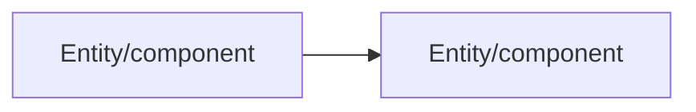

# Output Template

The output shape below is fixed — every review, on every PR, on every runtime, follows this skeleton. Consistency of shape is what makes output scannable; only the content inside each section varies.

## Kickoff block

````
PR REVIEW — [PR title]
Branch: [branch] → Base: [base]
Spec match: [Found: specs/NNN-name/ | None found — reviewing from diff only]
Files changed: [n] | Lines: +[x] / -[y]
[If component count is large]: Pacing: [n] components — recommend splitting into multiple sessions. Proceed in one pass, or split?

## Structural Overview
[2-4 sentences: what changed, how components connect]

## Data Flow
[short list: entity in → transform → entity out]
[If non-trivial and the runtime renders Mermaid]:


## Components ([n], in call/dependency order)
1. [Component] — [file link] — one-line purpose — [risk tag]
2. [Component] — [file link] — one-line purpose — [risk tag]
...

Walking through each component now.
````

## Per-component block (repeated once per component, one at a time)

```
### Component [i]/[n]: [Name]
📄 [file link at the relevant line]
Role: [what this component does in the flow]
Risk: [risk tag from Phase 3 — informs how much scrutiny this section gets]
Look for:
- [specific thing to check, line-level where possible]
- [specific thing to check]
Question: [only if something warrants a decision — otherwise: "No concerns here — moving on."]
[If a Question is raised]: Severity: blocking | significant | minor
[If the reviewer directs a change]: Applied — [what changed] — [file link to the diff/commit]
```

## Re-review block (used instead of the kickoff block when resuming after changes)

```
Re-review — commit [sha]
[n] file(s) changed since last pass: [file list]

### Component [i]/[n]: [Name] — re-checked
[item]: [what was flagged] ✅ resolved | still open | changed — [detail]
...
[If nothing left to flag in this component]: No new concerns in this component. Moving to Component [i+1]/[n].
```

## Summary block (always last)

```
## Review Summary
| Component | Finding | Severity | Decision | Notes |
|---|---|---|---|---|
| ... | ... | Blocking / Significant / Minor / — | Approved / Change requested / Applied / Resolved / Open question | ... |

Open questions: [n] | Follow-ups filed: [n]

The table above is the exact preview of what would post to the PR (plus a "Reviewed by:" line).
Who conducted this review (name or handle)? And: post as-is, add details first, or skip posting?
```

## Rules for filling the template

- Never skip a section, even if empty — an empty "Data Flow" because the PR is non-functional (e.g. config-only) should say so explicitly rather than omitting the heading.
- The summary table must include every component from the kickoff list, even ones with "No concerns" — completeness of the table is what makes it useful as a record later.
- File links must resolve to an actual line in the current file, not just the file — use whatever URI scheme the runtime supports (e.g. `vscode://file/{absolute-path}:{line}`).
- An "Applied" decision must link to the actual diff or commit that made the change, not just describe it — and must only appear where the reviewer explicitly directed that edit (see `principles.md`).
- The pacing flag line only appears when the component count actually crosses the threshold in `principles.md` ("Respect the review's attention budget") — omit it otherwise; don't manufacture concern about a small PR.
- A component's risk tag must appear in both the kickoff component list and its per-component block, and must actually inform the depth of that component's "Look for" section — see `principles.md`, "Weight scrutiny by risk."
- The Mermaid diagram is additive to the Data Flow list, never a replacement for it, and only appears when the flow/relationships are non-trivial and the runtime is known to render Mermaid — omit it otherwise rather than leaving an unrendered code block in the transcript (see `principles.md`, "Diagram when it fits, never invent one").
- Severity applies only to an actual finding — a component with "No concerns" has no severity, and gets "—" in the summary table rather than a fabricated tier (see `principles.md`, "Tag severity separately from decision").
- The closing preview-and-question block always appears — never skip it and never post without an explicit choice to do so (see `principles.md`, "Post only when asked, never as a verdict"). Never invent or assume a reviewer name; ask.
- A posted comment always carries a "Reviewed by: [name]" line — this is a record of whose decisions these were, not the process's own verdict. An "Additional notes" section appears only when the reviewer supplied text for it, and that text is theirs verbatim, not a rephrasing of the findings above.
