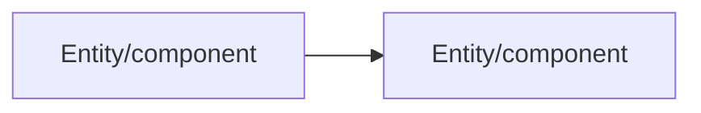

# Output Template

The output shape below is fixed — every review, on every PR, on every runtime, follows this skeleton. Consistency of shape is what makes output scannable; only the content inside each section varies.

**The fenced blocks below show literal text, not something to wrap your output in.** Everything inside a fence — headings, bold labels, the summary table, the Mermaid block — is the literal markdown to produce. Reproduce it as real, *unfenced* markdown in the actual output (a chat turn, a PR comment), so it renders properly: real headings, a real table, a real diagram. Never wrap the actual output in an additional enclosing code fence — that turns all of this into flat, unstyled text instead, and the Mermaid block specifically will never render as a diagram if it's nested inside anything, regardless of backtick count.

**A newline alone does not start a new line in rendered Markdown.** Two adjacent lines with no blank line between them collapse into one paragraph and get joined with a space — a "Branch:" line immediately followed by a "Stated intent:" line renders as one squished-together sentence, not two scannable fields. Wherever this template shows tightly-grouped label lines stacked directly on top of each other (the kickoff's header fields, `Role`/`Risk`, `Discussion`/`Severity`), end each line except the last with a backslash (`\`) — Markdown's explicit hard line break — so they render as separate lines without the extra vertical gap a full paragraph break would add. Elsewhere, where a little extra vertical space is fine, just use a blank line instead.

## Kickoff block

````
## PR Review — [PR title]

**Branch:** [branch] → **Base:** [base]\
**Stated intent:** [one-line paraphrase of the PR title/description, or "None given"]\
**Spec match:** [Found: `specs/NNN-name/` | None found — reviewing from diff only]\
**Files changed:** [n] | **Lines:** +[x] / -[y]

[If component count is large]: ⚠️ **Pacing:** [n] components — recommend splitting into multiple sessions. Proceed in one pass, or split?

### Structural Overview
[2-4 sentences: what changed, how components connect]

[If the diff does something the stated intent doesn't account for]: **Note:** the description says [X], but the diff also [Y] — worth confirming this is intentional.

### Data Flow
[short list: entity in → transform → entity out]

[If non-trivial and the runtime renders Mermaid]:


### Components ([n], in call/dependency order)
1. **[Component]** — [file link] — one-line purpose — _[risk tag]_
2. **[Component]** — [file link] — one-line purpose — _[risk tag]_
...

Walking through each component now.
````

## Per-component block (repeated once per component, one at a time)

Full form — used whenever there's a discussion point, a directed edit, or the component is high-risk (auth, security, concurrency, money, data integrity, public API) even if it turns out clean:

```
### Component [i]/[n]: [Name]

📄 [file link at the relevant line]

**Role:** [what this component does in the flow]\
**Risk:** _[risk tag from Phase 3 — informs how much scrutiny this section gets]_

**Look for:**
- [specific thing to check, line-level where possible]
- [specific thing to check]

**Discussion:** [only if something warrants a decision — otherwise: "No concerns here — moving on."]\
[If a discussion point is raised]: **Severity:** 🔴 Blocking | 🟡 Significant | ⚪ Minor

[If the reviewer directs a change]: ✅ **Applied** — [what changed] — [file link to the diff/commit]
```

Collapsed form — used only for a clean, low-risk component (pure refactor, config, internal helper):

```
**[i]/[n]: [Name]** — no concerns _([one-line reason])_
```

## Re-review block (used instead of the kickoff block when resuming after changes)

```
## Re-review — commit [sha]
[n] file(s) changed since last pass: [file list]

### Component [i]/[n]: [Name] — re-checked
- **[discussion point]** ([severity emoji] [severity]): [what was flagged] — ✅ resolved | still open | changed — [detail]
- [repeat one bullet per re-checked item in this component]

[If nothing left to flag in this component]: No new concerns in this component. Moving to Component [i+1]/[n].
```

## Summary block (always last)

```
## Review Summary

| Component | Discussion | Severity | Decision | Notes |
|---|---|---|---|---|
| ... | ... | 🔴 Blocking / 🟡 Significant / ⚪ Minor / — | Approved / Change requested / Applied / Resolved / Open discussion | ... |

**Open discussions:** [n] | **Follow-ups filed:** [n]

The table above is the exact preview of what would post to the PR (plus a "Reviewed by:" line).

Who conducted this review (name or handle)? And: post as-is, add details first, or skip posting?

[If the runtime is VS Code]: Also export this walkthrough as a `.tour` file for browsing in VS Code? (yes/no)
```

## Rules for filling the template

- Never wrap the actual output in an enclosing code fence — see the note at the top of this document. Headings, bold, the table, and the Mermaid diagram only render for the reader if the output is genuine unfenced markdown.
- Never stack label lines with a bare newline and expect them to render separately — see the note at the top of this document. Use a trailing backslash for tightly-grouped fields, or a blank line where the extra space doesn't hurt.
- Never skip a section, even if empty — an empty "Data Flow" because the PR is non-functional (e.g. config-only) should say so explicitly rather than omitting the heading.
- The summary table must include every component from the kickoff list, even ones with "No concerns" — completeness of the table is what makes it useful as a record later.
- File links must resolve to an actual line in the current file, not just the file — use whatever URI scheme the runtime supports (e.g. `vscode://file/{absolute-path}:{line}`).
- An "Applied" decision must link to the actual diff or commit that made the change, not just describe it — and must only appear where the reviewer explicitly directed that edit (see `principles.md`).
- The pacing flag line only appears when the component count actually crosses the threshold in `principles.md` ("Respect the review's attention budget") — omit it otherwise; don't manufacture concern about a small PR.
- A component's risk tag must appear in both the kickoff component list and its per-component block, and must actually inform the depth of that component's "Look for" section — see `principles.md`, "Weight scrutiny by risk."
- The Mermaid diagram is additive to the Data Flow list, never a replacement for it, and only appears when the flow/relationships are non-trivial and the runtime is known to render Mermaid — omit it otherwise rather than leaving an unrendered code block in the transcript (see `principles.md`, "Diagram when it fits, never invent one").
- Severity applies only to an actual discussion point — a component with "No concerns" has no severity, and gets "—" in the summary table rather than a fabricated tier (see `principles.md`, "Tag severity separately from decision"). Always pair the severity word with its marker (🔴 Blocking, 🟡 Significant, ⚪ Minor) so a reader can triage the table by eye, not just by reading every row.
- The closing preview block always appears — never skip it and never post without an explicit choice to do so (see `principles.md`, "Post only when asked, never as a verdict"). Never invent or assume a reviewer name; ask.
- A posted comment always carries a "Reviewed by: [name]" line — this is a record of whose decisions these were, not the process's own verdict. An "Additional notes" line appears only when the reviewer supplied text for it, and that text is theirs verbatim, not a rephrasing of the discussion above.
- "Stated intent" reflects only what the PR title/description actually says — if there's no description, say "None given" rather than inferring one from the diff. The Structural Overview's mismatch note only appears when the diff genuinely does something unaccounted for; don't manufacture a discrepancy where the description is just brief.
- The collapsed per-component form is only for a clean, low-risk component. A clean high-risk component still gets the full block — see `principles.md`, "Collapse the clean ones, but not the risky ones."
- A re-reviewed discussion point always carries its original severity forward, marker included — a still-open blocking item and a still-open minor one must not read the same.
- A "Change requested" row's Notes must say why it wasn't applied inline — no edit tool on this runtime, or the reviewer chose to leave it to the author — so a later reader knows whether the fix still needs to happen.
- The `.tour` export offer only appears when the runtime is VS Code — never on other runtimes — and it's a separate yes/no from the PR-posting choice; saying yes to one doesn't imply the other (see `principles.md`, "Offer a .tour export where it fits, never assume it").
