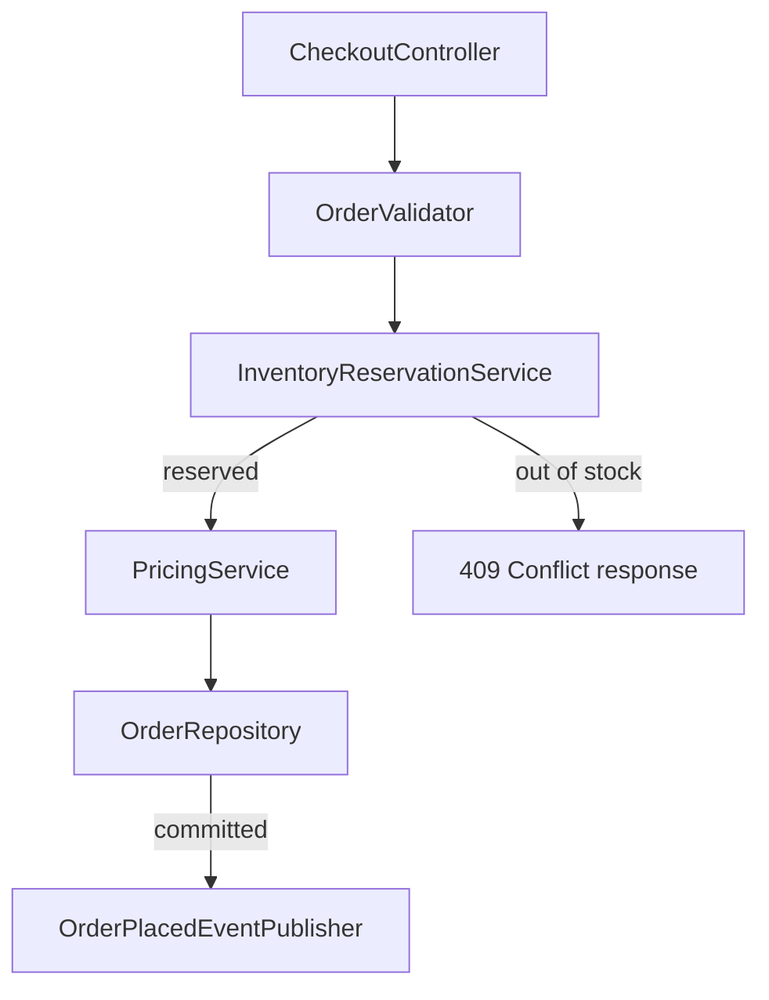

# Example session: a multi-component checkout pipeline

A larger, six-component PR — a full checkout flow from HTTP entry point through inventory reservation, pricing, persistence, and event publishing. The branching data flow is genuinely hard to follow as prose, so this is the case where the optional Mermaid diagram earns its place (see [`principles.md`](../.apm/skills/guided-pr-review/principles.md), "Diagram when it fits, never invent one"). No spec/plan folder for this one either. Reviewer turns are quoted; everything else is the process's output, following [`output-template.md`](../.apm/skills/guided-pr-review/output-template.md).

---

````
PR REVIEW — Add checkout pipeline (validate, reserve, price, persist, publish)
Branch: feature/checkout-pipeline → Base: main
Spec match: None found — reviewing from diff only
Files changed: 6 | Lines: +340 / -12

## Structural Overview
Adds the full checkout flow: an API controller validates the incoming cart,
reserves inventory for each line item, prices the order, persists it in a
single transaction, and publishes an OrderPlaced event only after that
transaction commits. An out-of-stock item short-circuits straight to a 409
response, bypassing pricing, persistence, and the event entirely.

## Data Flow
Cart → validated cart → inventory reservation (or 409) → priced order →
persisted order → OrderPlaced event


## Components (6, in call/dependency order)
1. CheckoutController — src/Api/Controllers/CheckoutController.cs — HTTP
   entry point for POST /api/checkout — new public API surface
2. OrderValidator — src/Orders/OrderValidator.cs — validates cart contents
   before processing — internal helper, low complexity
3. InventoryReservationService — src/Inventory/InventoryReservationService.cs
   — reserves stock per line item — concurrency-sensitive, shared state
4. PricingService — src/Pricing/PricingService.cs — computes the final
   total including discounts and tax — touches money
5. OrderRepository — src/Data/OrderRepository.cs — persists the order and
   its reservation in one transaction — data integrity
6. OrderPlacedEventPublisher — src/Events/OrderPlacedEventPublisher.cs —
   publishes to the message bus after commit — internal helper, low risk

Six components, well under the pacing threshold — one session is fine.

Walking through each component now.
````

```
### Component 1/6: CheckoutController
📄 src/Api/Controllers/CheckoutController.cs:18
Role: HTTP entry point; deserializes the cart and kicks off the pipeline.
Risk: new public API surface
Look for:
- line 22: no idempotency key on the request — a client retry after a
  timeout could submit the same cart twice
Question: should this endpoint require an idempotency key to prevent a
duplicate checkout on client retry?
Severity: significant
```

> **Reviewer:** Good catch, but that's a bigger change than this PR should
> carry — let's track it separately. Filed IDEMPOTENCY-142.

```
### Component 2/6: OrderValidator
📄 src/Orders/OrderValidator.cs:12
Role: Validates the cart (non-empty, positive quantities) before anything
downstream runs.
Risk: internal helper, low complexity
Look for:
- line 15-20: rejects empty cart and non-positive quantities
Question: No concerns here — moving on.
```

```
### Component 3/6: InventoryReservationService
📄 src/Inventory/InventoryReservationService.cs:30
Role: Reserves stock for each line item; the branch point that decides
reserved vs. out-of-stock.
Risk: concurrency-sensitive, shared state
Look for:
- line 34: reads current stock, then writes stock - quantity as two
  separate steps — not atomic
Question: under concurrent checkouts for the same SKU, can two requests
both read stock before either decrements it, over-reserving?
Severity: blocking
```

> **Reviewer:** Yes, that's a real race. Change it to a single atomic
> update — `UPDATE Inventory SET Stock = Stock - @qty WHERE Sku = @sku AND
> Stock >= @qty`, check rows-affected for the out-of-stock branch.

```
Applied — replaced the read-then-write with a single conditional UPDATE
statement, branching on rows-affected — c4d5e6f
```

```
### Component 4/6: PricingService
📄 src/Pricing/PricingService.cs:40
Role: Computes the order total from reserved line items, applying
discounts before tax.
Risk: touches money
Look for:
- line 44: discounts applied before tax — correct order
- line 48: `Math.Round(total, 2)` — no explicit MidpointRounding
Question: should the rounding mode be explicit, given this is a financial
total?
Severity: minor
```

> **Reviewer:** Yeah, let's be explicit rather than rely on the default.

```
Applied — changed to Math.Round(total, 2, MidpointRounding.AwayFromZero)
— c4d5e6f
```

```
### Component 5/6: OrderRepository
📄 src/Data/OrderRepository.cs:25
Role: Persists the order and its inventory reservation together.
Risk: data integrity
Look for:
- line 28-35: order and reservation writes wrapped in one TransactionScope
Question: No concerns here — moving on.
```

```
### Component 6/6: OrderPlacedEventPublisher
📄 src/Events/OrderPlacedEventPublisher.cs:16
Role: Publishes OrderPlaced to the message bus after the order commits.
Risk: internal helper, low risk
Look for:
- line 19: publish failure is caught and logged, doesn't roll back the
  already-committed order
Question: No concerns here — moving on.
```

```
## Review Summary
| Component | Finding | Severity | Decision | Notes |
|---|---|---|---|---|
| CheckoutController | No idempotency key on checkout requests | Significant | Open question | Follow-up filed: IDEMPOTENCY-142 |
| OrderValidator | — | — | Approved | Empty-cart and quantity checks confirmed |
| InventoryReservationService | Stock decrement not atomic under concurrent checkouts | Blocking | Applied | Switched to conditional UPDATE; commit c4d5e6f |
| PricingService | Rounding mode left implicit for a financial total | Minor | Applied | Explicit MidpointRounding.AwayFromZero; commit c4d5e6f |
| OrderRepository | — | — | Approved | Order + reservation committed in one transaction |
| OrderPlacedEventPublisher | — | — | Approved | Publish failure doesn't roll back the order, by design |

Open questions: 1 | Follow-ups filed: 1

The table above is the exact preview of what would post to the PR (plus a "Reviewed by:" line).
Who conducted this review (name or handle)? And: post as-is, add details first, or skip posting?
```

> **Reviewer:** jsmith — add details: "Idempotency (IDEMPOTENCY-142) is
> tracked separately and will land before this ships to prod."

```
Posted to PR #517:

## Review Summary
| Component | Finding | Severity | Decision | Notes |
|---|---|---|---|---|
| CheckoutController | No idempotency key on checkout requests | Significant | Open question | Follow-up filed: IDEMPOTENCY-142 |
| OrderValidator | — | — | Approved | Empty-cart and quantity checks confirmed |
| InventoryReservationService | Stock decrement not atomic under concurrent checkouts | Blocking | Applied | Switched to conditional UPDATE; commit c4d5e6f |
| PricingService | Rounding mode left implicit for a financial total | Minor | Applied | Explicit MidpointRounding.AwayFromZero; commit c4d5e6f |
| OrderRepository | — | — | Approved | Order + reservation committed in one transaction |
| OrderPlacedEventPublisher | — | — | Approved | Publish failure doesn't roll back the order, by design |

Open questions: 1 | Follow-ups filed: 1
Reviewed by: jsmith

Additional notes:
Idempotency (IDEMPOTENCY-142) is tracked separately and will land before
this ships to prod.
```

---

This session shows the fuller shape of the template at once: a Mermaid diagram earning its place on a genuinely branching flow, risk tags spanning the categories `principles.md` names by name (public API, concurrency, money, data integrity), all four decision states in one summary table (approved, applied, applied again, and open question), severities running the full range (blocking, significant, minor), and the "add details" branch of the closing flow — the reviewer's own words, appended verbatim, not rephrased into the findings above.
