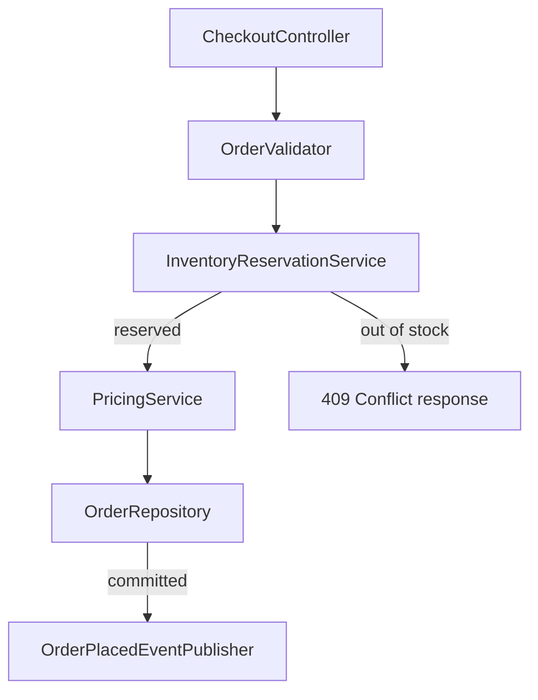

# Example session: a multi-component checkout pipeline

A larger, six-component PR — a full checkout flow from HTTP entry point through inventory reservation, pricing, persistence, and event publishing. The branching data flow is genuinely hard to follow as prose, so this is the case where the optional Mermaid diagram earns its place (see [`principles.md`](../.apm/skills/guided-pr-review/principles.md), "Diagram when it fits, never invent one"). No spec/plan folder for this one either.

Below is genuine rendered markdown, not a code block — this is what the process actually outputs, turn by turn, in a real session. That matters most here: the Mermaid block below is a real, top-level fence (not nested inside anything), so it renders as an actual diagram wherever this file is viewed, exactly as it would in a live session. Reviewer turns are quoted and marked with 💬 so they stand out from the process's own bold-heavy formatting; everything else is the process's own output, following [`output-template.md`](../.apm/skills/guided-pr-review/output-template.md).

---

## PR Review — Add checkout pipeline (validate, reserve, price, persist, publish)

**Branch:** feature/checkout-pipeline → **Base:** main\
**Stated intent:** "Implements the checkout pipeline: validate cart, reserve inventory, price the order, persist, publish OrderPlaced."\
**Spec match:** None found — reviewing from diff only\
**Files changed:** 6 | **Lines:** +340 / -12

### Structural Overview
Adds the full checkout flow: an API controller validates the incoming cart, reserves inventory for each line item, prices the order, persists it in a single transaction, and publishes an OrderPlaced event only after that transaction commits. An out-of-stock item short-circuits straight to a 409 response, bypassing pricing, persistence, and the event entirely.

### Data Flow
Cart → validated cart → inventory reservation (or 409) → priced order → persisted order → OrderPlaced event

### Components (6, in call/dependency order)
1. **CheckoutController** — `src/Api/Controllers/CheckoutController.cs` — HTTP entry point for POST /api/checkout — _new public API surface_
2. **OrderValidator** — `src/Orders/OrderValidator.cs` — validates cart contents before processing — _internal helper, low complexity_
3. **InventoryReservationService** — `src/Inventory/InventoryReservationService.cs` — reserves stock per line item — _concurrency-sensitive, shared state_
4. **PricingService** — `src/Pricing/PricingService.cs` — computes the final total including discounts and tax — _touches money_
5. **OrderRepository** — `src/Data/OrderRepository.cs` — persists the order and its reservation in one transaction — _data integrity_
6. **OrderPlacedEventPublisher** — `src/Events/OrderPlacedEventPublisher.cs` — publishes to the message bus after commit — _internal helper, low risk_

Six components, well under the pacing threshold — one session is fine.

Walking through each component now.

---

### Component 1/6: CheckoutController

📄 `src/Api/Controllers/CheckoutController.cs:18`

**Role:** HTTP entry point; deserializes the cart and kicks off the pipeline.\
**Risk:** _new public API surface_

**Look for:**
- line 22: no idempotency key on the request — a client retry after a timeout could submit the same cart twice

**Discussion:** should this endpoint require an idempotency key to prevent a duplicate checkout on client retry?\
**Severity:** 🟡 Significant

---

> 💬 **Reviewer:** Good catch, but that's a bigger change than this PR should carry — let's track it separately. Filed IDEMPOTENCY-142.

---

**2/6: OrderValidator** — no concerns _(empty-cart and quantity checks confirmed)_

---

### Component 3/6: InventoryReservationService

📄 `src/Inventory/InventoryReservationService.cs:30`

**Role:** Reserves stock for each line item; the branch point that decides reserved vs. out-of-stock.\
**Risk:** _concurrency-sensitive, shared state_

**Look for:**
- line 34: reads current stock, then writes stock - quantity as two separate steps — not atomic

**Discussion:** under concurrent checkouts for the same SKU, can two requests both read stock before either decrements it, over-reserving?\
**Severity:** 🔴 Blocking

---

> 💬 **Reviewer:** Yes, that's a real race. Change it to a single atomic update — `UPDATE Inventory SET Stock = Stock - @qty WHERE Sku = @sku AND Stock >= @qty`, check rows-affected for the out-of-stock branch.

---

✅ **Applied** — replaced the read-then-write with a single conditional UPDATE statement, branching on rows-affected — commit `c4d5e6f`

---

### Component 4/6: PricingService

📄 `src/Pricing/PricingService.cs:40`

**Role:** Computes the order total from reserved line items, applying discounts before tax.\
**Risk:** _touches money_

**Look for:**
- line 44: discounts applied before tax — correct order
- line 48: `Math.Round(total, 2)` — no explicit `MidpointRounding`

**Discussion:** should the rounding mode be explicit, given this is a financial total?\
**Severity:** ⚪ Minor

---

> 💬 **Reviewer:** Yeah, let's be explicit rather than rely on the default.

---

✅ **Applied** — changed to `Math.Round(total, 2, MidpointRounding.AwayFromZero)` — commit `c4d5e6f`

---

### Component 5/6: OrderRepository

📄 `src/Data/OrderRepository.cs:25`

**Role:** Persists the order and its inventory reservation together.\
**Risk:** _data integrity_

**Look for:**
- line 28-35: order and reservation writes wrapped in one `TransactionScope`

**Discussion:** No concerns here — moving on.

---

**6/6: OrderPlacedEventPublisher** — no concerns _(publish failure doesn't roll back the already-committed order, by design)_

---

## Review Summary

| Component | Discussion | Severity | Decision | Notes |
|---|---|---|---|---|
| CheckoutController | No idempotency key on checkout requests | 🟡 Significant | Open discussion | Follow-up filed: IDEMPOTENCY-142 |
| OrderValidator | — | — | Approved | Empty-cart and quantity checks confirmed |
| InventoryReservationService | Stock decrement not atomic under concurrent checkouts | 🔴 Blocking | Applied | Switched to conditional UPDATE; commit `c4d5e6f` |
| PricingService | Rounding mode left implicit for a financial total | ⚪ Minor | Applied | Explicit MidpointRounding.AwayFromZero; commit `c4d5e6f` |
| OrderRepository | — | — | Approved | Order + reservation committed in one transaction |
| OrderPlacedEventPublisher | — | — | Approved | Publish failure doesn't roll back the order, by design |

**Open discussions:** 1 | **Follow-ups filed:** 1

The table above is the exact preview of what would post to the PR (plus a "Reviewed by:" line).

Who conducted this review (name or handle)? And: post as-is, add details first, or skip posting?

---

> 💬 **Reviewer:** jsmith — add details: "Idempotency (IDEMPOTENCY-142) is tracked separately and will land before this ships to prod."

---

**Posted to PR #517:**

## Review Summary

| Component | Discussion | Severity | Decision | Notes |
|---|---|---|---|---|
| CheckoutController | No idempotency key on checkout requests | 🟡 Significant | Open discussion | Follow-up filed: IDEMPOTENCY-142 |
| OrderValidator | — | — | Approved | Empty-cart and quantity checks confirmed |
| InventoryReservationService | Stock decrement not atomic under concurrent checkouts | 🔴 Blocking | Applied | Switched to conditional UPDATE; commit `c4d5e6f` |
| PricingService | Rounding mode left implicit for a financial total | ⚪ Minor | Applied | Explicit MidpointRounding.AwayFromZero; commit `c4d5e6f` |
| OrderRepository | — | — | Approved | Order + reservation committed in one transaction |
| OrderPlacedEventPublisher | — | — | Approved | Publish failure doesn't roll back the order, by design |

**Open discussions:** 1 | **Follow-ups filed:** 1

**Reviewed by:** jsmith

**Additional notes:** Idempotency (IDEMPOTENCY-142) is tracked separately and will land before this ships to prod.

---

This session shows the fuller shape of the template at once: a Mermaid diagram earning its place on a genuinely branching flow, risk tags spanning the categories `principles.md` names by name (public API, concurrency, money, data integrity), all four decision states in one summary table (approved, applied, applied again, and open discussion), severities running the full range with their markers (🔴 blocking, 🟡 significant, ⚪ minor — scannable in the table without reading every row), and the "add details" branch of the closing flow — the reviewer's own words, appended verbatim, not rephrased into the discussion above.

It also shows both halves of "Collapse the clean ones, but not the risky ones" side by side: `OrderValidator` and `OrderPlacedEventPublisher` are both clean and both low-risk, so they collapsed to one line each. `OrderRepository` is also clean, but it's tagged data integrity — high-risk — so it kept the full block, Look-for bullets included, so the reviewer can see what was actually checked rather than take "no concerns" on faith.
